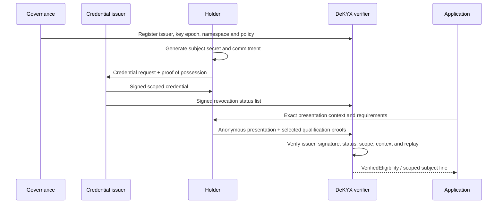
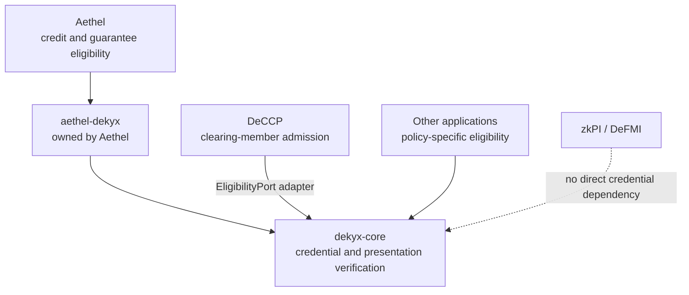

# DeKYX — Decentralized Know Your X

DeKYX is a reusable identity and participation-qualification layer for systems
that must verify eligibility without exposing more identity information than
the application needs.

`X` may be a person, legal entity, device, service, or autonomous agent. An
issuer creates a credential, the holder proves only the qualifications required
for one action, and the application receives a scoped eligibility result rather
than the holder's full identity record.

This repository contains standalone Rust crates. It is a research
implementation and has not been audited or certified as a KYC/KYB system.

## What DeKYX provides

- Governance-controlled issuer registration and issuer-key epochs.
- Credentials for multiple subject kinds and application scopes.
- Holder-generated secrets and proof-of-possession at issuance.
- Selective disclosure of required qualification attributes.
- Anonymous presentations bound to one audience, action, request, nonce, and
  validity window.
- Scope-specific nullifiers for controlled linkability within one policy.
- Re-randomized commitments across presentations and scopes.
- Signed, monotonic revocation status lists.
- Issuer-key rotation with grace periods and an immediate compromise path.
- Replay prevention using the presentation nullifier and exact context.
- Validated persistence formats for issuer directories and replay ledgers.
- A verified-result API for application-owned eligibility adapters.

## Credential and presentation flow



The application never receives the holder's secret. It receives only the
verified output needed to authorize the requested action.

## Core objects

| Object | Purpose |
|---|---|
| `IssuerDefinition` | Defines an issuer, key epoch, namespace, subject kinds, and validity window |
| `IssuerDirectory` | Holds validated issuer epochs and current revocation lists |
| `CredentialRequest` | Binds a holder-created commitment to an issuance proof |
| `Credential` | Contains the issuer-signed scope, policy, commitment, and qualification root |
| `RevocationStatusList` | Publishes an issuer-signed, epoch-ordered set of revoked credential digests |
| `PresentationContext` | Binds a proof to one audience, action, request, nonce, and expiry |
| `AnonymousPresentation` | Proves credential possession and selected qualifications for that context |
| `VerifiedEligibility` | Non-serializable result produced only after verification |
| `PresentationLedger` | Consumes a nullifier-context pair and rejects replay |

## Privacy model

The holder generates the subject secret and proves knowledge of the commitment
opening during issuance. The issuer does not receive that secret through the
normal API.

Qualification leaves are committed in a Merkle root. A presentation reveals
only the leaves required by the application's policy and proves that they
belong to the signed root. Its challenge includes the audience, action,
request, nonce, and expiration, so a transcript for one operation cannot be
moved to another.

A **subject line** is derived from the issuer, scope, policy, and scope
nullifier. It stays stable when the same holder receives a replacement
credential under a rotated issuer key, allowing an application to enforce one
line or one limit without learning a legal identity. Different scopes use
different nullifier bases and re-randomized commitments.

This version is **scope-pseudonymous**, not fully issuer-unlinkable. An
Ed25519-signed commitment is stable inside one credential and may be correlated
with the issuer's issuance record. Deployments requiring stronger issuance
unlinkability need a rerandomizable credential scheme such as a reviewed BBS+
or CL-signature adapter.

## Revocation, rotation, and replay

Every accepted issuer-key epoch must have a signed status list. A missing or
stale list fails closed, and an older list cannot replace a newer one.

Key rotation registers a strictly higher epoch and bounds earlier epochs by a
grace instant. A grace instant before the old key's start time provides an
immediate compromise response. Previously verified application records remain
application state; the retired key cannot authorize a new presentation after
its allowed window.

`PresentationLedger` consumes the pair of scope nullifier and presentation
context. Re-randomizing the proof does not make the same action reusable. The
host must persist this ledger in authenticated storage because rolling it back
would re-enable a replay.

## Persistence boundary

- `IssuerRegistry` cannot be deserialized around its validation.
- `IssuerDirectory` restores only through a validated record conversion.
- Credentials, status lists, presentations, and contexts are wire data and are
  verified before use.
- `VerifiedEligibility` is deliberately not serializable; it is an output of
  verification, never a trusted input.

## Dependencies and integration

DeKYX is application-independent. Integrations consume its verified result
instead of reimplementing credentials.



| Module | Relationship |
|---|---|
| `dekyx-core` | Standalone credential, presentation, issuer, revocation, and replay implementation; no application dependency |
| Aethel | Owns `aethel-dekyx` in its repository and consumes `dekyx-core`; DeKYX never imports Aethel |
| DeCCP | Consumes a verified result through its `EligibilityPort` when admitting a clearing member |
| zkPI / DeFMI | Do not define credentials; a host may require DeKYX eligibility before creating or settling an instruction |

## Repository layout

```text
crates/
└── dekyx-core/     Issuers, credentials, qualification proofs, revocation, replay
```

## Enterprise PoC

[Enterprise PoC guide (Japanese)](docs/ENTERPRISE_POC_JA.md) covers role
separation, qualification policy, revocation, key rotation, replay rejection,
evidence retention and acceptance criteria.

## Build and verification

Run the checks on Linux with the locked dependency graph:

```sh
cargo test --workspace --locked
cargo clippy --workspace --all-targets --locked -- -D warnings
cargo fmt --all -- --check
cargo build --workspace --release --locked
```

The published revision passed these four gates. A real deployment must also
define issuer governance, evidence standards, corporate-group resolution,
revocation operations, data-retention policy, and jurisdiction-specific
KYC/KYB obligations.
