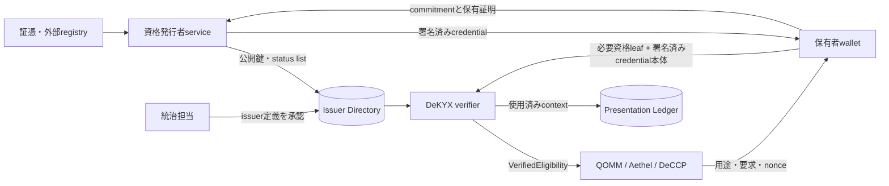

# DeKYX 企業向けPoC導入ガイド

## このPoCで確認すること

DeKYXは、人、法人、機器、サービス、AIエージェントなどが、必要な参加条件を
満たすことだけをアプリケーションへ示すための資格確認基盤である。PoCでは、
本人・法人情報そのものを配るのではなく、用途を限定した検証結果を渡す。

確認する項目は次である。

- 発行者、鍵の版、資格体系を統治側が明示的に承認する。
- 保有者が自分で秘密値を生成し、発行者へ渡さない。
- 必要な資格leafだけを選んで提示する。現行形式では、署名済みcredential本体も提示へ含まれる。
- 提示を対象アプリ、操作、要求、nonce、期限へ結び付ける。
- 同一用途内の重複参加を検出しつつ、異なる用途を公開上で結び付けない。
- 失効、発行鍵更新、再発行、再送を失敗側へ閉じる。

この実装は研究用であり、法令上の本人確認、継続的顧客管理、制裁照合、反社会的勢力
確認、実在性確認を自動的に満たすものではない。PoCでは架空の主体と合成属性を使う。

## 推奨する担当者

| 担当 | PoCでの役割 |
|---|---|
| 統治担当 | 信頼する発行者、資格体系、鍵更新、停止手続きを承認する |
| 発行者担当 | 証憑を審査し、資格credentialと失効情報を発行する |
| 保有者担当 | 秘密値を管理し、用途ごとの提示を作る |
| 検証者担当 | context、必要属性、失効、再送を検証する |
| アプリ担当 | `VerifiedEligibility`だけを業務判断へ接続する |
| 法務・セキュリティ担当 | 個人情報、保存期間、鍵、監査、事故対応を確認する |

## 必要な環境

- インターネットへ公開しないLinux環境。
- Gitと、`Cargo.lock`を変更せず利用できるRust toolchain。リポジトリに
  `rust-toolchain.toml` はないため、PoC開始時の `rustc --version` を記録し、承認版を揃える。
  統合Docker buildが現在使う参照版はRust 1.97.1である。
- 架空の発行者、法人、属性、用途、失効事例。
- 永続化と再送確認用の認証済みストレージ候補。

## 1. ソースと基準試験を固定する

```sh
git clone https://github.com/shukob/dekyx.git
cd dekyx
git checkout <社内で承認したcommit>
git rev-parse HEAD

cargo test --workspace --locked
cargo clippy --workspace --all-targets --locked -- -D warnings
cargo fmt --all -- --check
cargo build --workspace --release --locked
```

PoCの証拠にはcommit、Cargo.lockのSHA-256、Rust版、各コマンドの終了コードを残す。

## 2. 既存試験を業務フローとして読む

最小の発行・提示・再送拒否は次で実行できる。

```sh
cargo test --locked -p dekyx-core --test protocol \
  selective_qualification_proof_hides_other_attributes_and_consumes_context_once \
  -- --exact --nocapture
```

鍵更新と同一主体線の継続は次で確認する。

```sh
cargo test --locked -p dekyx-core --test protocol \
  key_rotation_bounds_the_old_epoch_and_keeps_the_subject_line \
  -- --exact --nocapture
```

異なる用途を公開上で結び付けないこと、status listのfail-closedと永続化復元は、同じ
`crates/dekyx-core/tests/protocol.rs` の対応試験を実行する。実際に失効済みcredentialの提示を
拒否する端から端までの基準事例はAethel adapter側にある。

```sh
cargo test --manifest-path ../aethel/Cargo.toml --locked -p aethel-dekyx --test adapter \
  revoked_wrong_context_or_foreign_issuer_evidence_is_rejected \
  -- --exact --nocapture
```

これらはライブラリの基準事例であり、実際の証憑審査、発行者業務、HSM、外部DBを
検証するものではない。

## 3. PoC用の資格体系を定義する

実装前に、表計算ではなく版管理された設定として次を決める。

- `subject_kind`: 人、法人、機器などの対象種類。
- issuer ID、公開鍵、key epoch、有効期間。
- namespace digestと資格policy ID。
- 用途scopeと、用途内で同一主体を数える範囲。
- 必須属性、許容値、証憑、更新頻度。
- presentation audience、action、request ID、nonce、期限。
- status listの発行頻度と最大許容経過時間。
- 鍵漏洩時の即時停止と通常更新の違い。

同じ「法人確認済み」でも、取引参加、保証提供、決済口座開設などの用途が違えば
別scopeと別policyにする。アプリが必要としない属性は要求しない。

## 4. 発行から検証までを分離する

PoCでは少なくとも次を別プロセスまたは別権限で動かす。

1. 統治側が `IssuerDefinition` を承認し、`IssuerDirectory`へ登録する。
2. 保有者がsubject secretとcommitmentを生成する。
3. 保有者が `CredentialRequest` と秘密値保有証明を発行者へ渡す。
4. 発行者が証憑を確認し、署名済み `Credential` を返す。
5. 発行者がkey epochごとの `RevocationStatusList` を公開する。
6. アプリが必要条件と `PresentationContext` を保有者へ提示する。
7. 保有者が必要資格leafとMerkle経路を選び、署名済み `Credential` 本体を含む
   `AnonymousPresentation` を作る。
8. 検証者が発行者、署名、status、scope、context、再送を確認する。
9. アプリは `VerifiedEligibility` と用途内subject lineだけを受け取る。

`VerifiedEligibility`を保存して後から信頼入力として再投入しない。毎回、元の提示と
現在の信頼状態から検証して生成する。

## 5. アプリケーションへ接続する

アプリケーションは法的氏名や登録番号ではなく、次を受け取る境界にする。

- 資格を満たしたか。
- どのscopeとpolicyに対する結果か。
- 有効期限。
- 用途内subject line。
- presentation nullifierとcontext digest。

DeKYX coreへAethel、DeCCP、DeFMI固有の型を入れない。固有の対応はadapter crateまたは
ホストアプリに置く。Aethel接続の例は `aethel-dekyx` にある。

```sh
cargo test --manifest-path ../aethel/Cargo.toml --locked -p aethel-dekyx --test adapter -- --nocapture
```

## 6. 必須の拒否試験

- 未登録発行者、異なるnamespace、異なるkey epoch。
- 保有者秘密を開けないcredential request。
- 必須属性不足、許容範囲外、別policyの属性。
- 別audience、別action、別request、別nonceへの提示転用。
- 期限切れcontextとcredential。
- status list未発行、古いstatus list、失効済みcredential。
- 同じpresentationの再送と、再ランダム化した同一操作の再送。
- 鍵更新後の旧鍵期限超過と、漏洩時の即時停止。
- 同じ主体が再発行を受けた場合の用途内重複。
- 異なるscope間の公開識別子比較。
- 改ざんした永続化recordからの復元。

拒否時にアプリケーション側の参加状態、上限、予約を作らないことも確認する。

## 7. 永続化と運用

次を認証済みストレージへ保存する。

- 承認済みissuer directoryと鍵epoch。
- 最新のstatus listと単調増加するstatus epoch。
- 使用済みpresentation nullifierと正確なcontext。
- 統治承認の監査記録。

`PresentationLedger`を古いバックアップへ戻すと再送が再び通るため、rollbackを検出する。
アプリケーションDBとDeKYX replay状態を別々に復元する場合は、復元点の対応を検査する。

## 8. 秘密性の確認

- 発行者ログにsubject secretがない。
- verifierの受信境界ではcredential ID、issuer署名、subject commitmentを含むcredential本体が
  見える。アプリへは `VerifiedEligibility` だけを渡し、credential全文を業務ログへ残さない。
- 非要求属性のleaf、subject secret、秘密openingがapplicationへ渡らない。
- 異なるscopeの提示から同一主体を公開上で結び付けられない。
- 同一scopeでは、上限管理に必要なsubject lineだけが安定する。
- 発行者が発行時のsubject commitmentを保存していれば、提示内の同じcommitmentと正確に
  照合できることを明示する。

現行方式はscope-pseudonymousであり、発行者に対して完全にunlinkableな匿名credentialでは
ない。より強い発行者非連結性が要件なら、方式選定と外部監査を別工程にする。

## 9. 保存する証拠

- Git commit、Cargo.lock、Rust版。
- issuer定義、policy、scope、context schemaの版とSHA-256。
- 公開鍵fingerprint、key epoch、status epoch。
- 正常提示、失効、再送、鍵更新、context差替えの判定結果。
- アプリへ渡った項目一覧と、渡らなかった属性一覧。
- 永続化、再起動、rollback試験の結果。

実顧客情報、秘密鍵、subject secret、credential openingを証拠へ残さない。

## 10. PoC合格条件

- 発行者、保有者、検証者、アプリの権限とデータが分離される。
- アプリは必要属性の適格結果だけを受け取る。
- 同一用途の再送・重複を拒否し、別用途は公開上で結び付かない。
- status list未取得、期限切れ、失効、鍵事故時に失敗側へ閉じる。
- 再起動後もissuer状態とreplay状態が巻き戻らない。
- アプリ固有処理がcoreではなく明示的adapterにある。

## 本番移行前に別途必要なもの

- 法令・業界ルールに基づく証憑、審査、継続管理、記録保存。
- 発行者契約、責任分界、監督、監査、鍵管理、HSM。
- 制裁、PEP、反社、実質的支配者、法人グループ解決などの外部業務。
- 個人情報保護、削除・訂正、越境移転、漏洩時対応。
- 暗号監査、脅威分析、負荷試験、災害復旧。

DeKYXは確認済み証拠を最小開示で運ぶ層であり、証憑の真実性そのものを作る層ではない。

## 11. 実装されている範囲

現在のworkspaceは汎用の `dekyx-core` だけからなる。Aethel専用adapterはAethelリポジトリに移した。

| crate | 提供するもの | 提供しないもの |
|---|---|---|
| `dekyx-core` | 発行者台帳、credential、資格の部分提示、匿名提示証明、失効、再送防止 | 実在確認、制裁照合、与信、清算、決済 |

完成済みの本人確認SaaS、管理画面、証憑OCR、政府registry接続、HSM接続、REST API serverはこの
workspaceに含まれない。企業PoCではcoreを基準に、発行者service、holder wallet、verifier service、
信頼台帳配信を自社環境で包む。

対応する対象種別は次である。

- 人。
- 法人。
- 機器。
- service。
- 自律agent。

DeKYXのXはこの対象種別を表す。ただし、種別を選ぶだけで対象の実在性が確認されるわけではない。
発行者が何をどの証拠で確認したかをpolicyとして定義する。

## 12. 全体構成



各serviceを同じ管理者権限で動かすことはできるが、PoCで確認したい権限分離が弱くなる。少なくとも
発行鍵、holder秘密、verifier trust state、application業務状態は別process・別storage権限にする。

## 13. 暗号の役割

### 13.1 発行者署名

発行者はEd25519でcredentialと失効status listへ署名する。検証者は `IssuerDirectory` に事前登録された
公開鍵とkey epochを使う。提示の中に入っている公開鍵をそのまま信じない。

### 13.2 subject commitment

holderは自分でsubject secretとblindingを作り、Ristretto255上のcommitmentへする。発行者へsecretを
渡さず、commitmentを正しく開けることだけを発行時証明で示す。

subject secretはゼロを許さない。仮想マシンcloneで乱数状態が重複しないよう、OS乱数源を確認する。

### 13.3 資格のMerkle root

資格は `namespace` と、正確なpredicate/schema/値のdigestからなる。全資格を正規順へ並べ、Merkle rootを
credentialへ署名する。提示時は要求されたleafと経路だけを渡し、他の資格を列挙しない。ただし、
Merkle rootを持つ署名済みcredential本体は `AnonymousPresentation` の一部として渡る。

namespaceの例:

```text
jp.kyb
market.qomm.participant
defmi.settlement.member
aethel.credit.provider
device.mpc.node
```

文字列だけに意味を持たせず、predicate digestが参照するschema、判定規則、証拠種類、版をregistryへ
保存する。

### 13.4 匿名提示証明

holderは、credentialのsubject commitmentを開けることと、scope用nullifierが同じsubject secretから
作られたことを、secretを見せずに証明する。発行者署名、必要資格のMerkle proof、contextも同時に
検証する。現行proofはcredential本体を隠すものではない。verifierはcredential ID、issuer ID/key epoch、
subject kind、subject commitment、scope/policy/資格root、status epoch、有効期間、発行者署名を読む。
隠れるのはsubject secretとblinding、および選択しなかった資格leafである。

### 13.5 scope nullifier

同じsubject secretでもscopeごとに異なる公開点になる。同一scope内では安定するため、一法人がwalletを
変えて複数回参加することをまとめられる。異なるscope間では単純比較で結合できない。

これは完全匿名ではない。発行者は自分が発行したcredentialを知り、通信metadataや業務データから主体を
推測できる。PoC報告では「scope内の仮名性」と表現する。

### 13.6 context binding

提示は次へ束縛する。

- scope。
- audience。
- action。
- request。
- challenge nonce。
- 有効期限。

同じcredentialを持っていても、別取引、別API、別アプリへ提示を移せない。context digestをapplication側と
holder側で独立計算し、同じbytesであることを確認する。

## 14. trustと責任の分離

| 主体 | 信頼すること | 信頼しないこと |
|---|---|---|
| 統治側 | 発行者選定とpolicy承認 | 個々の提示内容の手作業検証 |
| 発行者 | 証憑審査結果と署名鍵 | holderが申告した秘密値の正しさだけ |
| holder | 自分のsecretとcredential保管 | verifierが不要属性を要求しない保証 |
| verifier | 登録済みissuer、status list、proof | applicationの与信・取引判断 |
| application | `VerifiedEligibility` の限定結果 | credential原文を再解釈すること |

一つの発行者が誤って資格を発行すれば、暗号はその誤りを修正しない。複数発行者、二段階承認、外部
registry receiptなどが必要なら、policyの必要資格として明示する。

## 15. 推奨ハードウェア

数値はPoC開始値であり、保証値ではない。credential数、status list件数、提示頻度、保存期間で測り直す。

### 15.1 最小機能確認

- 4 vCPU。
- メモリ8 GiB。
- SSD空き30 GiB。
- 64ビットLinux。

同じhostでissuer、holder、verifierを動かしても、APIとproofの動作確認にしかならない。

### 15.2 企業PoC

| 役割 | 台数 | vCPU/台 | メモリ/台 | SSD/台 | 主な負荷 |
|---|---:|---:|---:|---:|---|
| 発行者API | 2 | 4 | 8 GiB | 100 GiB | 審査取込、署名、status生成 |
| 発行者DB | 2 | 4 | 16 GiB | 300 GiB | 証拠参照、発行記録、監査 |
| verifier | 2以上 | 4 | 8 GiB | 50 GiB | 署名、Merkle、匿名証明検証 |
| issuer directory配信 | 2 | 2 | 4 GiB | 50 GiB | 署名済みtrust bundle |
| replay ledger DB | 3構成を検討 | 4 | 16 GiB | 200 GiB | contextの一回消費 |
| holder wallet gateway | 法人ごと | 2 | 4 GiB | 30 GiB | secretとcredential管理 |
| 監視・監査 | 1 | 4 | 16 GiB | 300 GiB | 秘密を除いたevent |

現行方式はCPUで動き、GPUを必須にしない。提示検証より、外部registry、証憑審査、DB I/O、status listの
大きさが律速する場合もあるため、暗号benchmarkだけでcapacityを決めない。

### 15.3 HSM

発行者署名鍵はHSM利用を検討する。ただし、このworkspaceに特定HSM製品adapterが完成しているわけでは
ない。Ed25519署名、key handle、rate limit、二者承認、backup/restoreが製品で実現できるか検証する。

holderのsubject secretを発行者HSMへ置かない。holderまたは法人walletの秘密である。

## 16. OSとnetwork

- 長期保守版の64ビットLinuxを使う。
- build環境とruntime環境を分ける。
- issuer署名serviceはpublic ingressから直接触らせない。
- verifierはapplication network内に置き、mTLSで呼出元を認証する。
- directory/status配信は署名で完全性を確認し、TLSだけに依存しない。
- 管理面、発行面、提示検証面、監査面をnetwork分離する。
- root実行を避け、secret directoryとDB volumeを最小権限にする。

時刻はissuer、holder、verifierで同期する。credential、status list、presentation contextの三つに期限が
あるため、どれか一つでも無効なら拒否する。NTP未同期を検知したverifierは成功を返さない。

## 17. ソースとbuild成果物を固定する

```sh
git clone https://github.com/shukob/dekyx.git
cd dekyx
git checkout <承認commit>
git rev-parse HEAD
sha256sum Cargo.lock
rustc --version --verbose
cargo metadata --locked --format-version 1 > poc-output/dekyx-cargo-metadata.json
```

正式な試験は承認済みremote Linuxで実行する。ローカルMacでの成功を受入証拠にしない。

成果物には次を結ぶ。

- Git commit。
- Cargo.lock digest。
- Rust toolchain。
- enabled feature。
- target triple。
- release binaryまたはservice image digest。
- SBOMとlicense一覧。

## 18. 資格policyの設計

「KYC済み」「KYB済み」の一項目だけでは曖昧すぎる。policy表には次を持つ。

| 項目 | 例 |
|---|---|
| policy IDと版 | `qomm-maker-jp/v3` |
| subject kind | `legal_entity` |
| 対象scope | 特定QOMM venue参加 |
| 必須証拠 | 法人registry、許認可、口座保有 |
| predicate | 有効法人、対象業種、制裁非該当 |
| 判定主体 | issuer IDとkey epoch |
| 更新頻度 | 日次、取引前、年次等 |
| 最大有効期間 | 30日等、業務で決定 |
| 失効条件 | 解散、許認可停止、制裁該当 |
| application出力 | trueと限定digestだけ |

外部証拠の原文はissuer側の規制保存領域へ置き、credentialには資格rootとpolicy digestだけを入れる。
個人情報をhashしただけの値をpublic registryへ置くと辞書攻撃され得るため、直接公開しない。

### 18.1 法人グループ

一法人が複数子会社やwalletを使うことへの上限管理には、何を同一主体線とするかをpolicyで決める。

- 法的法人単位。
- 連結企業group単位。
- 規制上の顧客group単位。
- 同一beneficial owner単位。

DeKYX coreが企業groupを自動推論するわけではない。issuerが確認したgroup資格または専用scopeを発行し、
applicationがそのsubject lineへ上限を結ぶ。

## 19. 発行者登録

`IssuerDefinition` には次が必要である。

- 32-byte issuer ID。
- 1以上のkey epoch。
- 有効なEd25519公開鍵。
- 対応subject kindの空でない集合。
- 資格namespace全体のdigest。
- 有効開始・終了時刻。
- Active/Suspended/Revoked状態。

最初のepochは `register_issuer`、以降は `rotate_key` を使う。同じissuer/epochの上書きは拒否される。
永続recordを直接deserializeしてtrust anchorを差し替えることもできず、復元時に全定義とstatus署名を
再検査する。

登録手順:

1. 法的契約と運用審査を完了する。
2. issuer IDとnamespaceを割り当てる。
3. HSMまたはPoC鍵を生成する。
4. 公開鍵、期間、対応subjectを二者確認する。
5. 定義bytesとdigestへ統治承認する。
6. directoryへ登録する。
7. 空でもよいので初回の署名済みstatus listを公開する。
8. verifierが同じdirectory digestを読み戻す。

status listがないepochは失敗側へ閉じる。credential署名が正しくても提示を受理しない。

## 20. holder walletの準備

holderはsubject secret、blinding、credential、資格witnessを保管する。subject secretはscopeをまたぐ主体線の
根になるため、通常のAPI tokenより強く保護する。

### 20.1 保管

- 暗号化された専用volume。
- OS key storeまたはHSM/secure enclaveの利用可能性を評価。
- backupは複数人承認と暗号化。
- secretをapplication log、crash dump、support ticketへ出さない。
- 本番とtestで別secretを使う。

### 20.2 scope変更

別scope用credentialではwitnessを再ランダム化し、公開commitmentを変える。subject secretと資格は維持し、
blindingだけ新しくする。これにより、異なるscopeのcredential commitmentを公開比較しにくくする。

### 20.3 recovery

secretを失うと同じscope subject lineを再現できない。再発行で新しいsecretを作る場合、旧主体線との
合流手続きをissuer/application側に用意する。安易に二つの主体線を有効にすると上限を二重取得できる。

## 21. credential発行の完全手順

1. applicationまたはissuerがcredential ID、scope、policy、期間、必要資格を決める。
2. holderがsubject secretとblindingからcommitmentを作る。
3. holderが `CredentialRequest` を作る。
4. holderが同じcommitmentを開けることの `CredentialIssuanceProof` を作る。
5. issuer APIがschema、ID、時刻、subject kind、epochを検査する。
6. issuerの業務審査が外部証拠を確認する。
7. issuerがholder proofを検証する。
8. 資格一覧を正規順にし、Merkle rootを計算する。
9. 発行者鍵でcredential statementへ署名する。
10. credentialをholderへ暗号化して返す。
11. 発行eventにはcredential digest、policy、epochだけを残す。

issuerはholderが送ったsubject commitmentを別の値へ置き換えない。holder proofが一致しない要求は
`InvalidIssuanceProof` または文脈不一致として拒否する。

### 21.1 発行APIの最小入力

```text
credential_id
issuer_id
issuer_key_epoch
subject_kind
subject_commitment
scope_digest
policy_digest
qualifications[]
status_epoch
valid_from
valid_until
holder_issuance_proof
external_review_reference
```

`external_review_reference` はcore型ではなく発行者業務DBの参照である。個人・法人証拠をcredentialへ
埋め込まない。

## 22. status listと失効

status listはissuer/key epochごとに持つ。status epochは単調増加し、古いものを新しいものとして上書き
できない。revoked credential digestはsort済み、重複なしである必要がある。

現在のcoreは一listあたり最大1,000,000件を形式上許容するが、その大きさを推奨する意味ではない。
配布時間、署名時間、memory、検証lookup、更新頻度を測る。大規模運用では分割方式や別registry構成を
設計して外部監査する。

### 通常失効

1. issuerが失効根拠を確認する。
2. credential digestを新status listへ加える。
3. status epochを進める。
4. list全体へ署名する。
5. directoryへpublishする。
6. 全verifierが新digestをreadbackする。
7. 旧credentialの提示が拒否されることを確認する。

### 発行鍵漏洩

issuer statusをSuspendedまたはRevokedにし、新しいkey epochへrotationする。旧epochのvalid_untilを
`valid_from` より前へ設定する経路では即時revoked扱いにできる。単に新鍵を追加しただけでは旧鍵が
期限まで使えるため、事故手順を分ける。

## 23. presentation作成

applicationは一回の操作ごとに新しいchallenge nonceを作る。holderは次を確認してから提示する。

- audienceが本当に接続先applicationか。
- actionが利用者の意図する操作か。
- request digestが表示した業務内容と一致するか。
- scopeがcredentialと同じか。
- valid_untilがcredential期限以内か。
- 求められた資格が必要最小限か。

holderは要求されたqualificationだけのMerkle proofを作り、subject secret保有証明とscope nullifierを
一つのtranscriptへ結ぶ。毎回新しいproof乱数を使う。

同じcontextでproofを再ランダム化しても、scope nullifierとcontext digestの組合せは同じため、
`PresentationLedger` が再送を拒否する。

## 24. verifierの受理順

検証は次の順を推奨する。

`IssuerDirectory::verifier()` から検証器を作り、directoryが検証済みのissuer定義とstatus listだけを
渡す経路を商品境界にする。coreの各構造体はpublicであり、呼出側が直接組み立てればdirectory確認を
迂回できるため、型が存在するだけではfail-closedを保証しない。service APIで直接構築を禁止し、
統合試験で未登録issuerがapplication状態を変えないことを確認する。

1. body長とschemaを確認する。
2. contextがapplicationの期待値と完全一致するか確認する。
3. context期限を確認する。
4. issuer ID/key epochをdirectoryから引く。
5. issuerがActive、期間内、対象subject kind対応か確認する。
6. namespace digestを確認する。
7. status listが存在し、署名済み、時刻内、十分新しいか確認する。
8. credential署名と期間を確認する。
9. 必要qualification集合が過不足なく一致するか確認する。
10. 各Merkle proofをcredential rootへ検証する。
11. anonymous presentation proofを検証する。
12. scope nullifierとcontextをreplay ledgerで原子的にconsumeする。
13. `VerifiedEligibility` を同じrequest処理へだけ返す。

proof検証後、application更新前にcrashすると再送との整合が難しい。replay consumeとapplication commandを
transactional inboxまたは同じ正本transactionへ結ぶ。

## 25. applicationが受け取る値

`VerifiedEligibility` は次を持つ。

- issuer IDとkey epoch。
- issuer namespace digest。
- subject kind。
- subject commitment。
- scope subject nullifier。
- 安定したsubject line ID。
- policy digest。
- presentation proof digest。
- credential/contextの短い方の有効期限。

applicationが本人氏名や法人番号を必要としない処理なら、これ以上を受け取らない。本人情報が法的に
必要な後続業務は、issuer側の開示手続または別の認可channelとして設計する。

`VerifiedEligibility` を長期credentialのように再利用しない。これは一回のcontext検証結果である。

## 26. replay ledgerの正本性

`PresentationLedger` は `(scope nullifier, context digest)` のhashを一回だけ登録する。複数verifierが同時に
同じ提示を受ける場合、単一process内のsetでは足りない。

企業PoCでは次のいずれかを使う。

- 強い一意制約を持つ共有DB。
- consensusで複製した状態機械。
- application正本と同じtransaction内のconsume。

DB例:

```text
presentation_use_id  PRIMARY KEY
subject_line_id
context_digest
proof_digest
application_request_id
consumed_at
directory_digest
status_epoch
```

同じkeyのinsert競合は、一つだけ成功させる。readしてからinsertする二段階ではraceする。

backup復元時には、replay ledgerをapplicationより古い時点へ戻さない。snapshotに両DBのcutoff、digest、
transaction log位置を結ぶ。

## 27. Aethelとの接続

Aethelリポジトリの `aethel-dekyx` は、Aethelのcredit/guarantee artifactごとの要求を次へ写す。

- request IDをscopeへ。
- issuer provider IDとkey epoch。
- subject kind、policy、必要資格。
- audience、action、artifact digest、challenge nonce。
- 有効期限。

検証後、Aethelへ `AethelSubjectBinding` を返す。同じissuer、scope、policy、nullifier、subject lineなら、
鍵更新やcredential再発行、proof transcript更新をまたいでも同じ匿名債務者線として扱える。

Aethel側へ置くのは薄いadapterだけで、発行者trust、status list、匿名証明、資格解釈はDeKYXが所有する。

PoCで確認する流れ:

1. credit provider向け提示を作る。
2. 別nonceでguarantee provider向け提示を作る。
3. 両方が同じAethel subject lineへ結ばれる。
4. key rotation後の再発行でも線が続く。
5. 失効、別issuer、別artifact contextは拒否される。

## 28. DeCCP、QOMM、DeFMIとの接続

### DeCCP

清算参加資格を `EligibilityPort` へ渡す。DeCCPはcredentialを保存せず、verified issuer、policy、subject
line、proof digest、有効期限だけを参加者状態へ結ぶ。marginや保証枠はDeCCP側の責任である。

### QOMM

Maker/Takerの参加資格、法人aggregate line、役割、商品権限を確認する。wallet単位の識別子で上限を
持たず、DeKYXのscope subject lineへprivacy budgetと探り回数を結ぶ。

### DeFMI

決済参加資格、asset保有権限、issuer権限を確認する。DeFMI public stateへcredential原文を置かず、
policy/proof digestとpseudonymous participant handleを結ぶ。

接続先ごとに別scopeとcontextを使う。ただし、規制上同じ法人aggregateへまとめる必要がある場合は、
issuerがその用途専用のgroup lineを発行する。

## 29. API serviceとして包む

### issuer API

- issuer定義参照。
- credential request受付。
- 外部審査caseへの結合。
- 発行結果取得。
- status list公開。

署名endpointを一般networkへ公開しない。credential requestは審査済みcase IDへ結ぶ。

### verifier API

```text
入力:
  requirement
  expected_context
  anonymous_presentation
  verification_time

出力:
  accepted | rejected | unavailable
  verified_eligibility (acceptedのみ)
  reason_code
  directory_digest
  status_epoch
```

credential全文をresponseやaccess logへ反射しない。`rejected` と `unavailable` を分ける。

### directory API

署名済みbundleをimmutable digestで配る。最新だけでなく、開始時刻までの短い履歴を保持する。ただし
verifierはapplication policyが指定したepochを無制限に受けない。

## 30. queueと冪等性

発行と提示を同期一回のHTTPで完結させず、次の状態を持つ。

### 発行

```text
received -> evidence_review -> approved -> signing -> issued -> delivered
                    |                         |
                    +-> rejected              +-> delivery_pending
```

同じcredential ID、issuer、epochの再発行を一意制約で防ぐ。delivery timeout時は同じcredential bytesを
再送し、新しく署名し直さない。

### 提示

```text
challenge_created -> presented -> verified -> replay_consumed -> application_applied
                                  |                              |
                                  +-> rejected                   +-> reconcile
```

`verified` だけで業務状態を更新せず、replay consumeとの原子性を確保する。

## 31. privacy設計の限界

### 隠せるもの

- 要求されなかった資格leaf。
- subject secretとcommitment blinding。
- 異なるscope間の直接的な共通nullifier。
- applicationが必要としない本人・法人属性。

### 残るmetadata

- credential本体のcredential ID、issuer ID、key epoch、subject kind、subject commitment、
  scope/policy/資格root、status epoch、有効期間、発行者署名。
- 提示contextのaudience、action、request、challenge nonce、期限。
- 提示時刻、送信元、body size。
- 同一scopeで安定するsubject line。
- 発行者が持つ審査caseと発行記録。

小さな利用者集合では、issuerやsubject kindだけで主体を推測できる。必要に応じ、複数issuerの共通policy、
期限bucket、relay、固定size envelope、batch処理を検討する。

### 発行者からの非連結性

現行方式は発行者に対してblind signatureを提供するものではない。発行者は発行時commitmentを知り、
提示にも同じsubject commitmentが含まれるため、記録を保持していれば正確に結び付けられる。
発行者自身にも提示を結び付けさせない要件は、別の匿名credential方式の選定、移行設計、性能・監査を
研究項目として扱う。

## 32. 監視

秘密を含めず、次を監視する。

- issuer/key epoch別の発行成功・拒否・失敗。
- status listのage、valid_until残時間、配信lag。
- directory digestのverifier間不一致。
- presentation検証のp50/p95/p99。
- reason code別拒否数。
- replay検出数。
- replay ledger insert競合とDB遅延。
- context期限切れ率。
- holder wallet delivery queue。
- 発行鍵/HSMのerrorとrate limit。

metric labelへcredential ID、subject nullifier、法人名を入れない。個別調査はアクセス制御したaudit eventの
digestから行う。

警報例:

- status listが最大許容ageへ接近。
- issuer epochがSuspendedなのに発行成功がある。
- 同じdirectory releaseでverifier digestが分裂。
- replayが平常値から急増。
- proof failureが特定client versionへ集中。
- NTPずれにより期限拒否が急増。

## 33. 性能測定

工程別に測る。

1. holder commitment作成。
2. issuance proof作成・検証。
3. qualification root作成。
4. credential署名。
5. 選択した資格数ごとのpresentation作成。
6. credential署名検証。
7. status lookup。
8. Merkle proof検証。
9. anonymous proof検証。
10. replay ledgerの原子的consume。

条件:

- credential内資格数1、8、32、256。
- 提示資格数1、4、16。
- status list 0、1千、10万、運用上限。
- verifier 1、10、100、想定同時数。
- 同一scope集中と多scope分散。
- directory/status更新中。
- replayを1%、10%混ぜる。

throughput、p50/p95/p99、error率、CPU、RSS、DB IOPS、response sizeを記録する。外部registry審査時間は
暗号処理とは別の業務SLAとして測る。

## 34. 障害注入

| 障害 | 期待挙動 | 証拠 |
|---|---|---|
| status list未配信 | 提示を拒否 | application状態不変 |
| 古いstatus list再送 | directoryが拒否 | status epoch不変 |
| issuer Suspended | 新規提示を拒否 | reason codeとdirectory digest |
| 発行鍵漏洩想定 | 旧epoch停止 | 旧提示拒否、新epoch受理 |
| verifier再起動 | directoryを再検証して復元 | trust anchor差替えなし |
| replay DB一台停止 | 強い一意性を維持または受付停止 | 二重application更新なし |
| replay DB rollback | startup/reconcileで検出 | 古いsnapshotを昇格しない |
| holder wallet復元 | subject lineが維持 | duplicate参加なし |
| context nonce重複 | applicationが生成事故を検出 | 新規challenge停止 |
| clock skew | 期限検証を失敗側へ | 成功を返さない |
| 壊れたpoint/scalar | decode/verify拒否 | crashしない |

## 35. セキュリティ確認

### issuer

- 鍵をapplication DBへ保存しない。
- 署名前にissuer ID、epoch、policy、期間を再確認する。
- 外部審査caseとrequest digestを結ぶ。
- operator単独でissuer定義とcredentialの両方を承認できない。
- status list発行を止めない監視と当番を持つ。

### holder

- subject secretを平文exportしない。
- 誰に、何のactionを提示するか表示する。
- 不要なqualification要求を拒否できる。
- 本番credentialをtestへ持ち込まない。
- backup復元で二重walletを同時稼働させない。

### verifier

- 提示内のissuer keyを信じない。
- status listなしでfail openしない。
- contextをclient自己申告だけで決めない。
- required qualification集合を過不足なく比較する。
- proof成功後にreplay consumeを省略しない。

### application

- credential原文を保存しない。
- subject lineを別scopeへ転用しない。
- 有効期限後にcached結果を使わない。
- 拒否時に参加枠や予約を作らない。
- DeKYX結果を与信・制裁判断そのものと表現しない。

## 36. backupと災害復旧

### backup対象

- issuer directoryと全key epoch。
- signed status lists。
- replay ledger。
- policy/schema registry。
- 発行監査eventと外部証拠参照。
- holder credentialとsubject secretはholder側の別手順。

発行秘密鍵はDB backupへ含めず、HSM/秘密管理の専用backup ceremonyを使う。

### restore検証

1. bundle署名とSHA-256を確認する。
2. `IssuerDirectoryRecord` をcore経由でdeserializeし、全定義を再検証する。
3. 各status list署名と単調epochを確認する。
4. replay ledger cutoffがapplication cutoff以上であることを確認する。
5. 既知replayを再提示し、拒否されることを確認する。
6. 既知の有効提示を新contextで受理する。

RPO/RTOをdirectory、status、replay、holderの各系統で別に決める。

## 37. よくある障害と切り分け

### `MissingStatusList`

credential発行後、該当issuer/key epochの空または最新status listがdirectoryへpublishされていない。
署名を省略して暫定受理せず、issuer側でlistを発行する。

### `StaleStatusList`

受信listのstatus epochが既存以下、またはcredentialが要求するepochより古い。cache、配信順、issuerの
単調counterを確認する。

### `RequirementMismatch`

issuer ID/epoch、scope、policy、資格集合、context、credential/contextの期間、件数上限のどれかが
異なる。credential全文をlogへ出さず、各field digestと版だけを比較する。

### `IssuerNotAuthorized`

登録issuerが対象時刻・subject kindで有効でない、またはdirectoryのnamespace digestと要求が違う。
namespaceと非対応subject kindは `RequirementMismatch` ではなくこちらになる場合がある。提示内の値で
directoryを自動更新せず、承認済みtrust bundleを確認する。

### `InvalidAnonymousProof`

wrong witness、scope変更、転送破損、乱数/pointの問題が考えられる。holder側のcredential digest、context
digest、required qualification digestを比較し、secretは収集しない。

### `ReplayedContext`

正常なnetwork再送ならapplicationの既存結果へ収束する。異なるproof digestが同じcontextを使う場合も
同一操作なので二回適用しない。challenge nonce生成の重複も調査する。

### key rotation後に同一subject lineにならない

同じsubject secret、issuer ID、scope、policyを維持しているか確認する。credential ID、key epoch、blindingは
変わってもよい。issuerまたはscopeを変えれば別線になる。

### 異なるscopeが結び付いて見える

同じsubject commitmentを再利用していないか、witnessを `rerandomize` したか、application logが法人IDを
併記していないか確認する。暗号だけで周辺DBの共通IDは消えない。

## 38. 段階的PoC

### 段階A: core protocol

- 一発行者、一holder、一verifier。
- credential発行、必要資格leafの選択提示（署名済みcredential本体は提示に含む）。
- context再送拒否。
- status listなし、期限切れ、失効拒否。

### 段階B: service分離

- issuer、holder、verifier、directory、replay DBを別processへ置く。
- mTLSと最小権限。
- queue、retry、監視。
- 再起動とbackup restore。

### 段階C: issuer/key運用

- 複数issuer。
- 通常key rotation。
- 鍵漏洩時の即時停止。
- status配信遅延とfail-closed。
- HSM候補の性能・障害試験。

### 段階D: application統合

- QOMMのMaker/Taker参加。
- DeCCP清算member。
- DeFMI決済participant。
- Aethel credit/guarantee providerと匿名債務者線。

### 段階E: privacyと容量

- 異scope非連結性のデータ検査。
- 同scope Sybil抑止。
- 大規模status list。
- 負荷、障害、災害復旧。

## 39. 最終提出物

- commit、Cargo.lock、compiler、image/binaryのdigest。
- 発行者、holder、verifier、directory、replay DBのnetwork図。
- CPU、memory、disk、OS、region、管理主体一覧。
- issuer/policy/scope/context schemaの署名済みbundle。
- issuer key ceremony、rotation、停止、status配信の記録。
- 発行、選択提示、失効、期限、再送、別context転用の試験結果。
- 異scopeで公開識別子が一致しない検査と、同scopeのsubject line継続結果。
- replay DB同時insert、rollback、restoreの結果。
- p50/p95/p99、throughput、status list別資源量。
- applicationへ渡したfieldと、渡さなかった個人・法人属性の一覧。
- 未実装の外部証憑、HSM、法令対応、暗号監査項目。

この証拠packageにも実在者の証憑、氏名、住所、秘密鍵、subject secret、credential openingを入れない。
